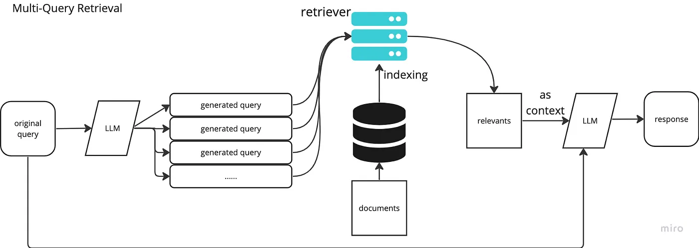

_This project has been created as part of the 42 curriculum by pgougne._

# Description
RAG Against the Machine is a 42 project designed to show us the power of LLMs.\
It demonstrates that even when trained on limited data, they can be highly effective if used correctly. The core principle is to maximize the accuracy of the LLM's responses by providing sources that are semantically relevant/frequency revelant to the user's question.

# Instructions
Install dependencies:
>make install

pin python 3.11
installing : pydantic fire langchain-text-splitters bm25s PyStemmer numpy tqdm dspy chromadb flake8 mypy

---
Index:
>make index

| Flag | Values | Meaning |
|------|--------|---------|
| --chroma | True/False | Chunking with chromaDB (slower) |
| --max_chunk_size | int | The max size of the chunks |
| --output_directory | str | The output directory for the bm25s chunking and chroma chunking (default = data/processed/)|
| --vllm | str | The path to the vllm (default = data/raw/vllm-0.10.1)|

---
Search:
>make search

| Flag | Values | Meaning |
|------|--------|---------|
| --k | int | Number of chunks for the question |
| --prompt | str | The question asked to the llm |
| --save_directory | str | The path where the programe save the data with questionid, question, sources etc. |
| --chroma | True/False | Add a semantic/hybrid search or not |
| --expansion | True/False | Use query expansion or not |

---
Search dataset
>make search-dataset

| Flag | Values | Meaning |
|------|--------|---------|
| --k | int | Number of chunks for the question |
| --dataset_path | str | The file with the list of questions asked to the llm |
| --save_directory | str | The path where the programe save the data with questionid, question, sources etc. |
| --chroma | True/False | Add a semantic/hybrid search or not |
| --expansion | True/False | Use query expansion or not |

---
Answer:
>make answer

| Flag | Values | Meaning |
|------|--------|---------|
| --k | int | Number of chunks for the question |
| --prompt | str | the question to ask to the LLM |

---
Answer dataset:
>make answer-dataset

| Flag | Values | Meaning |
|------|--------|---------|
| --k | int | Number of chunks for the question |
| --prompts_file | str | the path to the list of questions with their sources|

---
Evaluate:
>make evaluate

| Flag | Values | Meaning |
|------|--------|---------|
| --k | int | Number of chunks for the question |
| --answer_path | str | The path to the given file with the good source |
| --dataset_path | str | The path to the built file with the found source |
| --max_context_length | the len of the chunks | the len of the chunks |
---
use pdb
>make debug
---
delete all unwanted file
>make clean
---
flake and mypy
>make lint
---
flake and mypy in strict mode 
>make lint-strict
---
create venv
>make venv
---
UV initialisation
>make init

---

# System architecture

My RAG architecture is splitted in 6 differents parts.

Index:
class Index from src/index/index.py

Search:
class Search from src/search/search.py 

Search dataset:
class SearchDataset from src/search/searchDataset.py using earch class for each item in the dataset

Answer:
class Answer from src/answer/answer.py using dspy class to use the llm (src/answer/dspy.py) 

Answer dataset:
class AnswerDataset from src/answer/answerDataset.py using Answer class for each item in the dataset

Evaluate:
class Evaluate from src/evaluate/evaluate.py

Index is splitting document into chunks. Search is choosing the right chunk(s) for question(s). Then answer respond to the question with the sources choosed by the search command. Evaluate is giving a score to the search quality.

# Chunking strategy
Using Langchain splitter, it is easy to slip documents. They have a built in splitter to manage md and py files and many other code files. I also made a universal splitter if this is not a code file like a random txt. It splits the file into chunks with a maximum size of 2000 by default (--max_chunk_size flag).
Langchain splitter understand the file to not randomly split the file. For example, it splits a markdown using title because titles means that a new part is start with another meaning than the previous part.

# Retrieval method
If no flags for chroma and expansion are used, it only use bm25.
Bm25 calculates the frequency of words in the question compare to all the words from all the files.\
To see the bm25 model -> (https://www.elastic.co/blog/practical-bm25-part-2-the-bm25-algorithm-and-its-variables)\
So with this, Let's imagine that we have a lot of philosophical data. In the question **"Who ever said, *'I am dead'* without lying?"** the word "I" will have a little score because it is to common, but the words died or lying are more rare so there score would be higher. 
So the documents with the word lying or dead have better chance to rely on the target question.

ChromaBD is giving a score semanticly, not by frequency. The complex part is to merge the chroma score with the bm25 to get an hybrid result. Chroma and bm25 return a List of ids and a list of scores, but the scores are not calculate with the same level some it's impossible to use the score as a merging reference. So i used the index of the id in the list. I found a merging technique on internet to merge to different list by the index, here is the formula:\
ㅤㅤㅤㅤㅤ1ㅤㅤㅤㅤㅤㅤㅤㅤㅤㅤ1\
ㅤ---------------------------ㅤ+ㅤ------------------------------\
ㅤ 60 + bm25_indexㅤㅤㅤ60 + chroma_index

The query expansion is a bit different, it just gives extra words to the prompt with Qwen to upgrade the bm25 search. But sadly, it did not work upgrade the final score. 

# Performance analysis
For the code, my code can go to 62% with the right flags (for k=5) but can be higher if k > 5
only bm25 recall@5 = 57%
bm25 + chromadb = 61%
bm25 + chromadb + query expansion = 56%
bm25 + query expansion = 54%
Because the llm is not smart, the query expansion is bad
For the docs, my code only go to 80%/81% (for k=5) but can be higher if k > 5
only bm25 recall@5 = 80%
bm25 + chromadb = 61%
bm25 + chromadb + query expansion = 56%
bm25 + query expansion = 54%
# Design decisions
I decided to use the vllm (bonus) by fixing the vllm thanks to my peer https://github.com/Arcanovax
I also implemented semantic search, hybrid search and query expansion
this image is for multi-query retrieval, but it works the same for query expansion.

# Challenges faced
The main difficulty I faced was to understand the subject, to understand each part, what they create and need to work. If i didn't have corrected some of my peers on this project, i would be totally lost.

# Example usage
>make init
>make install
>make index

in the vllm_fix, to run the vllm:
>make

in the project:
>make search (change the file in the make file)

>make search-dataset

>make answer

>make answer-dataset

>make evaluate

# Resources

https://pydantic.dev/docs/validation/latest/concepts/serialization/
https://jsonlint.com/json-to-python
https://bm25s.github.io/
https://pydantic.dev/docs/validation/latest/concepts/models/
https://www.geeksforgeeks.org/artificial-intelligence/metadata-filtering-in-langchain/
